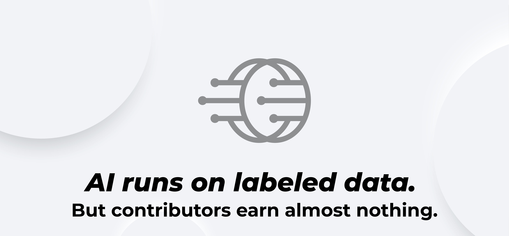

# 
The rapid advancement of Artificial Intelligence and Machine Learning (AI/ML) has created an insatiable demand for high-quality, accurately labeled datasets. These datasets are the foundational bedrock upon which AI models are trained, validated, and refined. However, the current data labeling ecosystem is plagued by several significant challenges that hinder the progress and scalability of AI development.

## 1. Centralization and Lack of Transparency

Many existing data labeling platforms operate under centralized models, where data ownership, labeling processes, and quality control mechanisms are opaque.

### Key Issues

- **Limited Data Ownership**: Data submitters often lose significant control or ownership over their data once it enters a centralized platform, raising concerns about data privacy, security, and intellectual property rights.

- **Lack of Transparency in Labeling**: The actual labeling process, including the qualifications of labelers and the methodologies used, can be obscure. This lack of transparency makes it difficult for data consumers to fully trust the quality and provenance of the labeled data.

- **Vendor Lock-in**: Centralized platforms can create dependencies, making it challenging for users to migrate their data or leverage alternative services without significant friction.

## 2. Scalability and Efficiency Constraints

Manual data labeling is inherently time-consuming and resource-intensive. As AI applications become more complex and data volumes explode, traditional methods struggle to keep pace.

### Critical Bottlenecks

- **Human Bottleneck**: Relying solely on human labelers, without intelligent assistance, creates a significant bottleneck in scaling data annotation efforts. This can delay AI project timelines and increase development costs.

- **Inconsistent Quality**: Maintaining consistent labeling quality across large teams of human annotators, especially for complex tasks, is a persistent challenge. Variations in interpretation and skill levels can lead to dataset biases and errors.

- **High Operational Costs**: The overhead associated with managing large labeling teams, quality assurance, and infrastructure contributes to high operational costs, which are often passed on to data consumers.

## 3. Limited Accessibility and Economic Barriers

The opportunity to participate in the data labeling economy is often restricted, creating economic barriers for individuals and limiting the global talent pool.

### Access Challenges

- **Skill Gap**: Many individuals lack the specialized skills required for complex data labeling tasks, and there are limited accessible pathways for them to acquire these skills and enter the industry.

- **Unequal Access to Earning Opportunities**: Earning opportunities in data labeling are not uniformly distributed, often favoring those in specific geographic locations or with pre-existing professional networks.

- **Lack of Incentives for Long-Term Engagement**: Current models often treat labelers as transient workers, with insufficient incentives for long-term engagement, skill development, and loyalty to a platform.

## 4. Data Monetization and Liquidity Challenges

For organizations and individuals who invest heavily in creating high-quality labeled datasets, monetizing these assets and ensuring their liquidity remains a significant hurdle.

### Monetization Issues

- **Fragmented Marketplaces**: The market for buying and selling labeled datasets is often fragmented, lacking a centralized, transparent, and efficient marketplace.

- **Lack of Standardized Ownership**: Establishing clear, verifiable ownership of digital datasets and facilitating their transfer or sale is complex in traditional systems.

- **Limited Liquidity**: Without a robust marketplace and clear ownership mechanisms, labeled datasets often remain illiquid assets, hindering their economic potential.

## The Need for Change

These challenges collectively create a data labeling ecosystem that is:

- **Inefficient** - Slow and costly processes
- **Inequitable** - Limited access and opportunities
- **Opaque** - Lack of transparency and trust
- **Inflexible** - Vendor lock-in and limited options

OANICAI directly confronts these challenges by proposing a decentralized, community-driven, and technologically advanced solution that redefines the data labeling paradigm.

**Next**: Learn how OANICAI addresses these challenges in our [Solution Overview](../platform/solution-overview).
